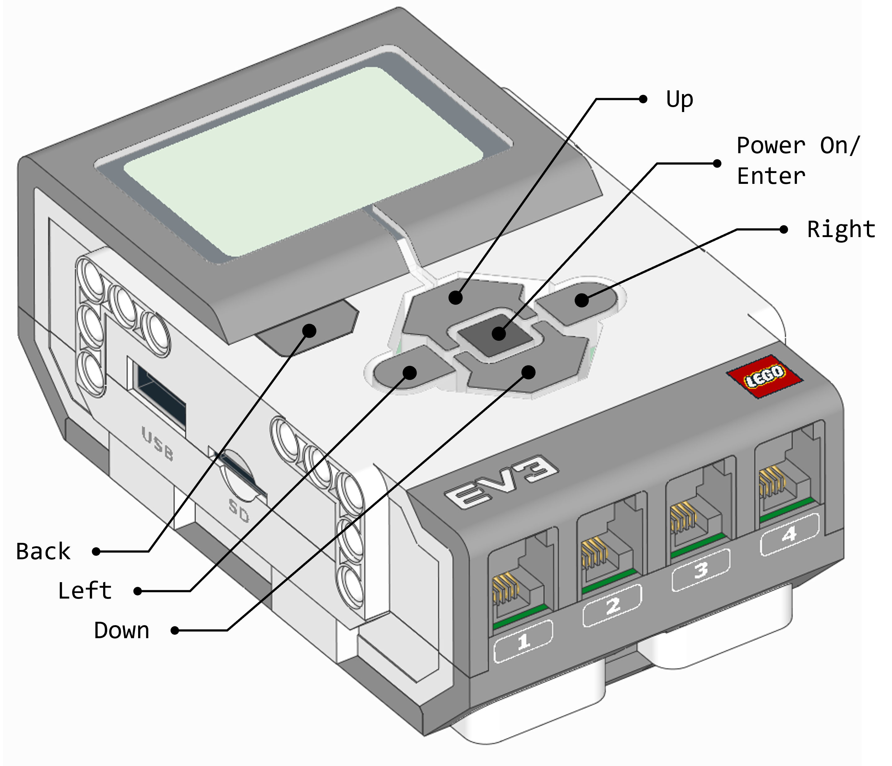

# RoboRacers: Can You Stay On The Track?

Welcome to _RoboRacers_! Today, we're going to use the LEGO® MINDSTORMS® EV3 robot and try to race it around the racetrack! Before we can start racing, we will need to think about how the robot will _see_ the racetrack. But first we need to master moving our robot around. So let's get going...

<!-- HTML/CSS style to centre images -->
<style>img {display:block; margin: 0 auto}</style>

<!-- Also, using a very dirty way of fixing pages with margin-bottom here. I know, really, I shouldn't have used MD if I wanted nice PDFs... but here we are... -->


## Getting Started
### The Robot

Let's turn the robot on. If the light behind the middle button is green then you're good to go. If there are no lights, press the middle button and wait for it to turn on. This could take a minute, so while you're waiting read on.



You will see the robot has two wheels (that it uses to move) and a range of sensors (we'll get to them later) all held together by lego. At the centre is a big box that we call the `brick`; it tells every other part of the robot what to do. At this stage, robots are just a pile of lego and electronics - not very intelligent - until we tell them what to do. This requires a `program`. 

### Running a program
Let's run a program.
Use the buttons to navigate `File browser > RoboChallenge > programs > starting.py`. Clicking `starting.py` will "run" that program. You should hear the robot say "Hello World", and turn a wheel! Press the `back` button to stop the program.


### Creating a program
Next we want to be able to write our own programs to get the robot to do what we want. You will write the code on the laptop using Visual Studio Code which many students and many professionals use to write code.

1. Turn the laptop on and open the application Visual Studio Code if not already.
1. From the `File` menu, select `Open Folder...`. Select `RoboChallenge` folder on the `Desktop`.
1. Open the file `starting.py` by clicking on it in the `Explorer` left panel. This was the program we just ran on the robot.

> Note: any line starting with # is a comment which the robot ignores. Every other line of code tells the robot to do something.

Make the following changes:

1. Change it to say "Hello [your names]".
1. Change the program to get the other wheel to turn.

Great, you've written your first program! Now we need to download it to the robot and run it.

1. Open the `Explorer` in the left panel of VSCode (see following image).
1. Connect EV3 to PC with a cable. (EV3 must be on and the light lit green)
1. Expand the `EV3DEV DEVICE BROWSER` from the bottom of the panel.
1. Click `Click here to connect to a device`.
1. Select your device (from the top of the screen).
1. Press `F5` (maybe `Fn + F5`) to `download and run current file`. Alternatively open the `Run and Debug` side panel and click the play button.

> Note: the robot will start running the program whilst still plugged in. You can uplug it once it has finished downloading and you can re-run the program unplugged as per the earlier instructions to run a program.


## Getting the robot to move

Open the file `moving.py`. You will see we have added the line `robot = DriveBase(...)`. 
It would be inconvenient if we had to control the robot through the motor speeds individually so instead we use `DriveBase` which provides some useful functions to control the robot:

To drive the robot in a straight line for the given `distance` in mm, use:
```
robot.straight(distance)
```

To turn the robot on the spot the given `angle` in degrees (°), use:
```
robot.turn(angle)
```

To combine driving forwards and turning, use this function. The robot will drive forwards at the speed `drive_speed` in mm/s and turn at the speed `turn_rate` in deg/s. This function starts the robot moving and it will continue until another command is given.
```
robot.drive(drive_speed, turn_rate)
```

Modify `moving.py` by using the functions above to attempt the following movements.

1. Drive forwards 500 mm
1. Drive backwards 500 mm
1. Turn 180° on the spot both ways
1. Drive in a square
1. Drive in a circle

> Hint: values can be negative.

> Challenge: get the robot to move by controlling the motors without `DriveBase`.

## Sensing

Did the robot finish exactly where it started when you drove in a square? The robot has no way to "see" where it is. Just like you trying to walk in a big square whilst blindfolded. To let our robots "see", we use **_sensors_** on them. In this part, we'll use the reflectance sensor. It shines some light onto the floor beneath it and measures how much is reflected, if the floor is light (white) it will have a high reflectance but if it's dark (black) the reflectance will be low.

1. Open the script `threshold-test.py`. You will see in the program we have added the sensor with the line 
    ```
    line_sensor = ColorSensor(Port.S3)
    ```
    and that we measure the reflectance and show it on the robot's screen with
    ```
    ev3.screen.print(line_sensor.reflection())
    ```
1. Run the program and look at the reflectance values shown on the robot's screen.
1. Move the robot (with your hand) so the sensor is directly above the line and make a note of the reflectance value. Repeat so you have a reflectance of the background surface too.
1. Now open `sensing.py` and input the values you measured for `LINE_REF` and `BACKGROUND_REF`.
1. Line up your robot pointing towards your finish line.
1. Get the robot to drive then stop at the finish line by downloading and running the program.
1. Examine the code and see if you can explain to a demonstrator how it works.


## Racing
Now our robot can see, it's time to try and get our robot to race around the track by following the line!

> Challenge: Pause before you look at the program and see if you can work out an **_algorithm_** for the robot to follow the line.

1. Open `racing.py` and input the same values for `LINE_REF` and `BACKGROUND_REF`.
1. Run the program and put your robot on the racetrack.
1. Read the comments that explain how the program works.
1. Adjust `FORWARD_SPEED` and `TURN_GAIN` so that the robot can complete the racetrack!

> Note: the robot follows the edge of a line (not the line itself). The `threshold` is defined as grey, the average of measured white and black. If the black line is on the left and the white background on the right, when the sensor sees more white than the threshold so it turns to the left to find the line and the opposite for when it sees too much black. This is why the robot can only follow one side of the line.

## Finishing
Congratulations for getting your robot to race around the racetrack! Was your robot able to stay on the track? We hope you have learnt one way that robots can see the world and that you consider a future in robotics!